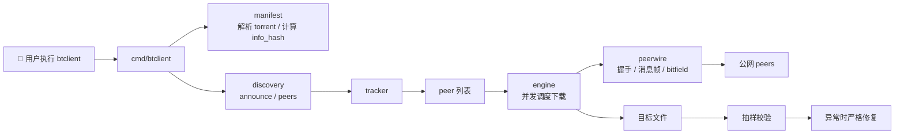
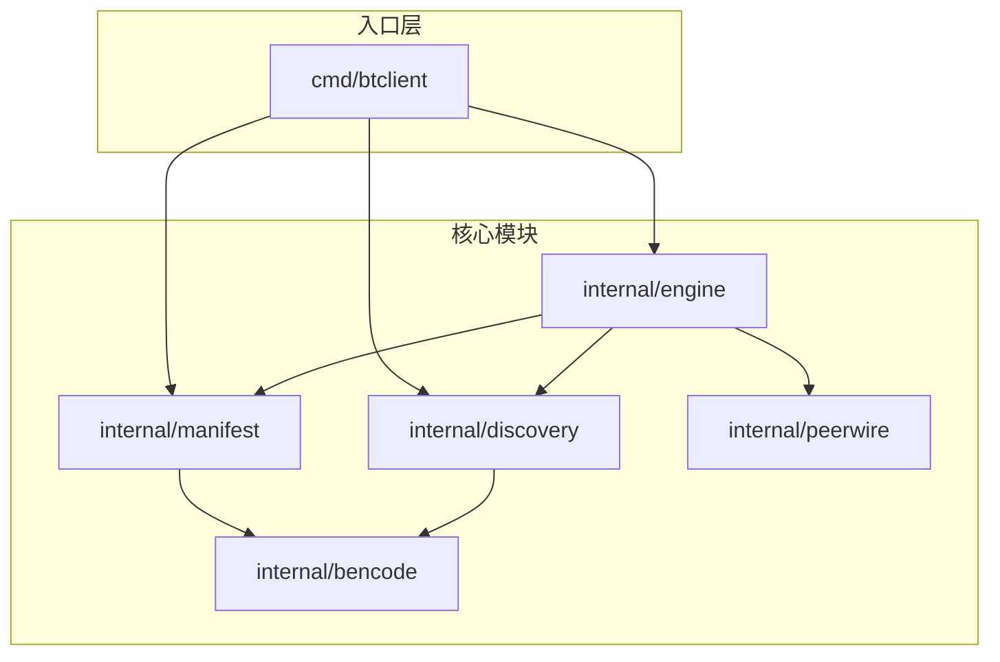
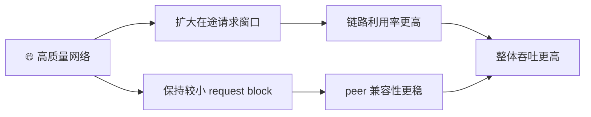
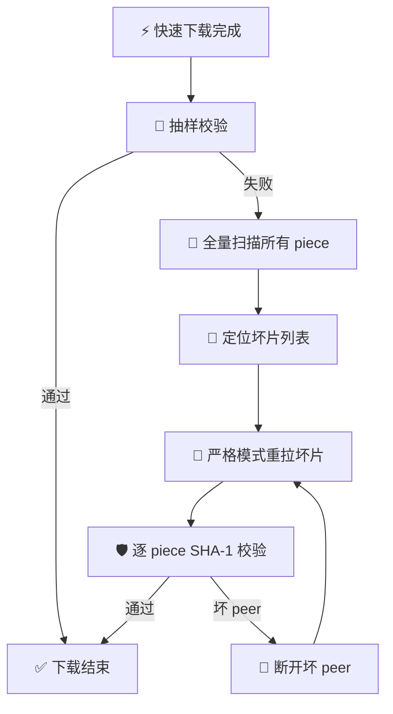
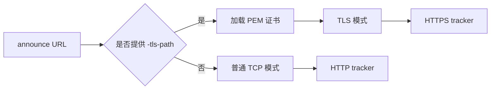
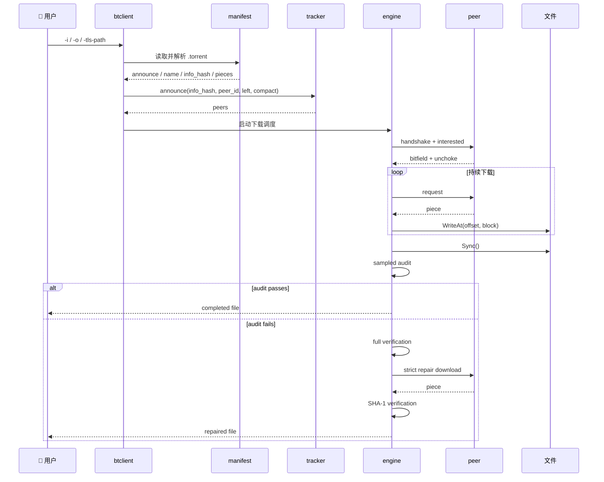
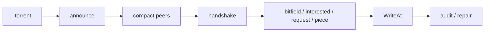

# bt-refractor

<div align="center">

一个面向数据中心部署场景的 Go 版 BitTorrent 单文件下载客户端。  
从零重新设计结构、命名、下载调度和校验路径，目标是做到:

**快一点 ⚡，稳一点 🛡️，更容易理解一点 📚**

<br />

[](https://go.dev/)
[](#-快速开始)
[](#-数据中心模式)
[](#-tracker-安全模式)
[](#-可靠性兜底)
[](./LICENSE)

</div>

---

## ✨ 项目定位

这个仓库不是“教材式最小 BT Demo”，也不是“全功能 BT 生态实现”。

它聚焦的是一条非常明确的链路:

- 输入一个 `.torrent`
- 访问 tracker 拿到 peers
- 与多个 peer 并发通信
- 直接把数据写到目标文件
- 默认按数据中心思路跑快路径
- 出现异常时自动切回严格修复路径

编译后的二进制名称固定为 `btclient`。

## 📚 目录

- [✨ 项目定位](#-项目定位)
- [🎯 一眼看懂](#-一眼看懂)
- [🚀 快速开始](#-快速开始)
- [🧩 功能一览](#-功能一览)
- [🏗️ 架构总览](#️-架构总览)
- [⚡ 数据中心模式](#-数据中心模式)
- [🛡️ 可靠性兜底](#️-可靠性兜底)
- [🔐 tracker 安全模式](#-tracker-安全模式)
- [🧠 一次下载到底发生了什么](#-一次下载到底发生了什么)
- [🗂️ 仓库结构](#️-仓库结构)
- [📡 协议速览](#-协议速览)
- [🧪 测试与验证](#-测试与验证)
- [📈 性能报告](#-性能报告)
- [📖 深入阅读](#-深入阅读)
- [❓ FAQ](#-faq)
- [📄 License](#-license)

## 🎯 一眼看懂

### 1. 这个仓库解决什么问题

| 维度 | 当前仓的选择 | 原因 |
| --- | --- | --- |
| 下载目标 | 单文件 torrent | 聚焦可稳定交付的主链路 |
| 部署环境 | 数据中心 / 任务型节点 | 网络较好、吞吐敏感、可批量运行 |
| 写盘策略 | 边下边按偏移写盘 | 避免整文件长期驻留内存 |
| 默认校验 | 下载后抽样校验 | 降低热路径 CPU 开销 |
| 异常处理 | 自动升级为严格修复 | 速度重要，但可靠性更重要 |
| tracker 访问 | HTTP 或携证书的 HTTPS | 满足机房内外网混合接入场景 |

### 2. 下载总流程图



### 3. 运行形态

```text
输入:
  .torrent 文件
  输出根路径
  可选 tracker 证书

处理:
  解析 torrent
  announce
  多 peer 并发下载
  直接写盘
  抽样校验
  必要时自动修复

输出:
  以 torrent name 命名的目标文件
```

## 🚀 快速开始

### 1. 构建

```bash
go build -o btclient ./cmd/btclient
```

### 2. 最小运行示例

```bash
./btclient -i /data/job/input.torrent -o /data/output
```

如果 torrent 的 `name` 是 `debian.iso`，最终输出路径就是:

```text
/data/output/debian.iso
```

如果 torrent 的 `name` 是 `images/debian.iso`，最终输出路径就是:

```text
/data/output/images/debian.iso
```

也就是说，`-o` 只提供输出根路径，最终文件名和相对子路径严格来自 torrent 元数据。

### 3. 带 tracker 证书的运行方式

```bash
./btclient -i /data/job/input.torrent -o /data/output -tls-path /data/certs/tracker.pem
```

### 4. 命令行参数

| 参数 | 含义 | 必填 |
| --- | --- | --- |
| `-i` | 输入 `.torrent` 文件路径 | 是 |
| `-o` | 输出根路径 | 是 |
| `-tls-path` | HTTPS tracker 使用的 PEM 证书路径 | 否 |

## 🧩 功能一览

### ✅ 已支持

- 读取 `.torrent`
- 解析单文件 torrent 的 `announce`、`info`、`name`、`length`、`piece length`、`pieces`
- 计算 `info_hash`
- 向 HTTP tracker 发起 announce
- 在提供证书时向 HTTPS tracker 发起安全请求
- 解析 compact peers
- 与 peer 建立 TCP 会话
- 完成 BitTorrent 握手
- 处理 `bitfield`、`interested`、`choke`、`unchoke`、`request`、`piece`、`have`
- 将下载数据直接写盘
- 默认下载后抽样校验
- 抽样失败后自动全量定位和坏片修复
- 需要时可切到逐 piece 全量校验

### ⛔ 当前不支持

- magnet
- UDP tracker
- 多文件 torrent
- seeding / uploading
- DHT / PEX / 扩展协议

### 🧭 能力矩阵

| 类别 | 当前状态 | 说明 |
| --- | --- | --- |
| CLI | ✅ | 仅保留 `-i`、`-o`、`-tls-path` |
| `.torrent` 解析 | ✅ | 只做单文件所需字段 |
| HTTP tracker | ✅ | 默认支持 |
| HTTPS tracker | ✅ | 需要显式传 PEM 证书 |
| compact peers | ✅ | 作为 announce 主返回格式 |
| peer wire | ✅ | 覆盖当前下载链路所需消息 |
| 直接写盘 | ✅ | 目标是降低内存驻留 |
| 数据中心快路径 | ✅ | 更大 pipeline、减少热路径校验 |
| 自动修复 | ✅ | 抽样失败后升级到严格模式 |
| 全量逐 piece 校验 | ✅ | `BTCLIENT_VERIFY_PIECES=1` |
| 多文件 torrent | ❌ | 当前不做 |
| 上传 / 做种 | ❌ | 当前不做 |

## 🏗️ 架构总览

### 1. 模块关系图



### 2. 模块职责表

| 模块 | 作用 | 关键词 |
| --- | --- | --- |
| `cmd/btclient` | CLI 入口、参数解析、环境变量装配 | `-i` `-o` `-tls-path` |
| `internal/bencode` | 最小 bencode 编解码器 | `Marshal` `Unmarshal` |
| `internal/manifest` | `.torrent` 解析、`info_hash`、piece 元数据 | `Load` `Parse` |
| `internal/discovery` | tracker announce、TLS/非 TLS 访问、compact peers 解码 | `Announce` |
| `internal/peerwire` | 握手帧、消息帧、bitfield 处理 | `Greeting` `Packet` `Bitmap` |
| `internal/engine` | 并发下载、写盘、抽样校验、严格修复 | `Manager` |

### 3. 4+1 视角入口

如果你想从架构角度快速理解这个仓库，建议直接看:

- [4+1 架构视图](docs/architecture-views.md)
- [协议与功能详解](docs/protocol-and-features.md)
- [与原始仓的详细对照](docs/compare-with-original.md)

## ⚡ 数据中心模式

这个仓库的默认运行策略不是“理论上最严”，而是“机房里更实用”。

### 1. 默认性能策略

- 保持兼容性更好的 `16 KiB` request block
- 提高每个 peer 的 request pipeline 深度
- 降低空闲轮询等待
- 减少高频逐片日志
- 默认不在热路径上做每 piece SHA-1
- 下载完成后做抽样校验



### 2. 为什么没有“放大单分片”

这里要区分两个概念:

1. torrent 的 `piece size`
   - 由制种阶段决定
   - 下载端不能改
2. request block 大小
   - 由下载端决定
   - 会影响单个 `request` 请求多少字节

当前实现没有继续默认放大 request block，而是优先扩大在途窗口。原因是:

- 在高质量网络下，更大的在途字节量通常比单块更大更有效
- 在有少量丢包时，较小 block 更容易控制重传影响
- 对更多 peer 来说，`16 KiB` 是更保守、兼容性更好的选择

### 3. 可调参数

```bash
BTCLIENT_PIPELINE_DEPTH=96 \
BTCLIENT_BLOCK_SIZE=16384 \
BTCLIENT_AUDIT_PIECES=48 \
BTCLIENT_REPAIR_ROUNDS=4 \
./btclient -i /data/job/input.torrent -o /data/output
```

| 环境变量 | 作用 | 默认思路 |
| --- | --- | --- |
| `BTCLIENT_PIPELINE_DEPTH` | 每个 peer 的在途请求数 | 数据中心里优先调它 |
| `BTCLIENT_BLOCK_SIZE` | 单个 request 的 block 大小 | 默认保守，不建议激进放大 |
| `BTCLIENT_AUDIT_PIECES` | 下载后抽样校验数量 | 平衡核验覆盖和收尾成本 |
| `BTCLIENT_REPAIR_ROUNDS` | 自动修复轮数 | 正常快路径无额外成本 |
| `BTCLIENT_VERIFY_PIECES` | 是否打开全量逐 piece 校验 | 更强调完整性时开启 |

## 🛡️ 可靠性兜底

这个仓库的关键点不是“下载快”，而是:

> 默认先快跑。  
> 一旦发现异常，自动切回严格模式，把坏片修好再结束。

### 1. 三层保障

| 层级 | 默认行为 | 目标 |
| --- | --- | --- |
| 热路径 | 不做每 piece SHA-1 | 把 CPU 留给网络收发和写盘 |
| 收尾层 | 对分布式抽样 piece 做校验 | 快速发现明显坏片 |
| 修复层 | 全量定位坏片并严格重拉 | 把异常任务兜住，不靠人工重试 |

### 2. 兜底流程图



### 3. 为什么这比“默认全量校验”更合适

- 正常任务占多数，快路径能显著减少热路径 CPU 消耗
- 异常任务占少数，自动修复把可靠性补回来
- 最终目标不是“平均吞吐最高”这一项，而是“吞吐不错，同时失败任务不需要人工接管”

## 🔐 tracker 安全模式

tracker 访问有两种模式:

1. 普通模式
   - 不传 `-tls-path`
   - 只允许访问非 TLS tracker
   - 拨号方式走普通 TCP
2. 安全模式
   - 传入 `-tls-path`
   - 加载 PEM 证书
   - 使用 TLS 建立 tracker 请求



## 🧠 一次下载到底发生了什么



### 文字版步骤

1. `cmd/btclient` 读取参数并生成 `peer_id`
2. `internal/manifest` 解析 `.torrent`
3. 基于 torrent 的 `name` 计算最终输出文件路径
4. `internal/discovery` 向 tracker announce，得到 peers
5. `internal/engine` 为每个 peer 启动一个 worker
6. worker 完成握手，读取 bitfield，发送 `interested`
7. peer `unchoke` 之后，worker 按 pipeline 连续发送 `request`
8. peer 返回 `piece` 后，客户端下载 block 并按偏移拼装
9. 数据直接写入目标文件
10. 默认情况下，下载结束后会对一组抽样 piece 做校验
11. 如果抽样失败，系统会自动升级为全量校验，定位出坏片
12. 坏片会在严格模式下被定向重拉，并逐 piece 做 SHA-1 校验
13. 如果启用了 `BTCLIENT_VERIFY_PIECES=1`，则从一开始就对每个 piece 在写盘前做 SHA-1 校验
14. 全部 piece 完成后，下载结束

## 🗂️ 仓库结构

```text
cmd/
  btclient/                CLI 入口
internal/
  bencode/                 最小 bencode 编解码
  manifest/                torrent 元数据解析
  discovery/               tracker announce / peers
  peerwire/                握手、消息帧、bitfield
  engine/                  调度、会话、写盘、校验、修复
workflow_integration_test.go
                           fake tracker + fake peer 端到端测试
docs/
  compare-with-original.md
  protocol-and-features.md
  architecture-views.md
```

## 📡 协议速览

### `.torrent` 元数据

当前只消费下载主链路需要的字段:

- 根字典
  - `announce`
  - `info`
- `info` 字典
  - `name`
  - `length`
  - `piece length`
  - `pieces`

其中 `pieces` 是连续的 SHA-1 摘要，每 20 个字节对应一个 piece。

### `info_hash`

计算方式:

1. 取出 `info`
2. 对 `info` 重新做 bencode 编码
3. 对编码结果做 SHA-1

### tracker announce

当前使用的参数包括:

- `info_hash`
- `peer_id`
- `port`
- `uploaded`
- `downloaded`
- `left`
- `compact`

当前消费的 tracker 返回包括:

- `interval`
- `peers`
- `failure reason`

### peer wire 消息

握手之后，当前下载链路会处理这些消息:

- `bitfield`
- `interested`
- `choke`
- `unchoke`
- `request`
- `piece`
- `have`

### 支持边界图



## 🧪 测试与验证

### 单元测试覆盖

| 模块 | 覆盖内容 |
| --- | --- |
| `internal/bencode` | bencode 编解码 |
| `internal/manifest` | torrent 解析、`info_hash`、piece span |
| `internal/discovery` | tracker announce、TLS 证书、HTTPS 限制、compact peers |
| `internal/peerwire` | 握手帧、消息帧、bitfield |
| `internal/engine` | piece 调度、peer 会话、抽样校验、坏片定位 |

### 端到端测试覆盖

- 使用 fake tracker + fake peer 跑完整下载链路
- 覆盖严格模式下载
- 覆盖“快路径坏片 -> 抽样发现 -> 全量定位 -> 定向修复”的自动兜底路径

### benchmark 覆盖

- `performance_benchmark_test.go`
  - 对比原始方案风格、严格大窗口、当前数据中心默认快路径
  - 用于生成可重复的性能对比数据

### 常用验证命令

```bash
go test -count=1 ./...
go build -o btclient ./cmd/btclient
go test -run '^$' -bench '^BenchmarkDownloadModes$' -benchmem -benchtime=2x -count=5 ./...
```

## 📈 性能报告

如果你关心：

- 原始方案和当前方案的核心性能差异
- 为什么当前仓更适合数据中心
- 实测 benchmark 提升了多少
- 快路径和可靠性之间是怎么折中的

建议直接阅读：

- [性能测试报告](docs/performance-report.md)

## 📖 深入阅读

- [性能测试报告](docs/performance-report.md)
- [与原始仓的详细功能对照](docs/compare-with-original.md)
- [协议与功能详解](docs/protocol-and-features.md)
- [4+1 架构视图](docs/architecture-views.md)

## ❓ FAQ

<details>
<summary><strong>为什么 <code>-o</code> 不是最终文件名？</strong></summary>

因为当前仓把 `-o` 定义成输出根路径，最终文件名由 torrent 的 `name` 决定。这更适合批处理任务和目录级落盘。

</details>

<details>
<summary><strong>为什么默认不做每 piece SHA-1？</strong></summary>

因为当前仓默认面向数据中心快路径。大多数时候网络质量较好，热路径更需要把 CPU 留给网络收发和写盘；但它并不是不校验，而是把严格校验放到了异常路径里。

</details>

<details>
<summary><strong>为什么不支持多文件 torrent？</strong></summary>

因为当前仓明确聚焦单文件下载主链路。这样可以让数据路径、落盘路径和测试边界都保持更清晰。

</details>

<details>
<summary><strong>如果抽样失败会怎样？</strong></summary>

会自动升级为全量校验，定位真正损坏的 piece，然后只重拉坏片，并在修复阶段强制做逐 piece SHA-1 校验。

</details>

<details>
<summary><strong>如果我更看重完整性而不是吞吐？</strong></summary>

直接打开:

```bash
BTCLIENT_VERIFY_PIECES=1 ./btclient -i /data/job/input.torrent -o /data/output
```

</details>

## 📄 License

本仓库使用 `0BSD`，属于极宽松协议。

你可以把它理解成:

- 可商用
- 可修改
- 可分发
- 可私有集成
- 不要求署名

---

如果你是第一次看这个仓库，建议阅读顺序是:

1. 先看本 README
2. 再看 [4+1 架构视图](docs/architecture-views.md)
3. 然后看 [协议与功能详解](docs/protocol-and-features.md)
4. 最后看 [与原始仓的详细功能对照](docs/compare-with-original.md)
