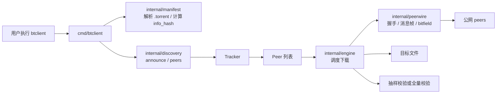
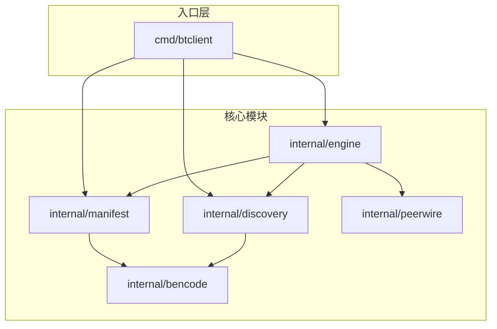
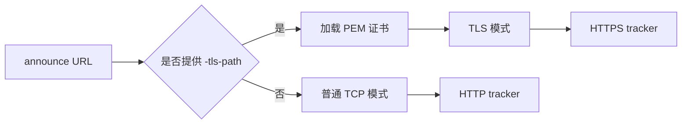
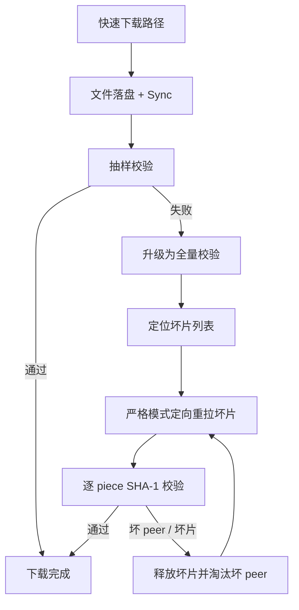
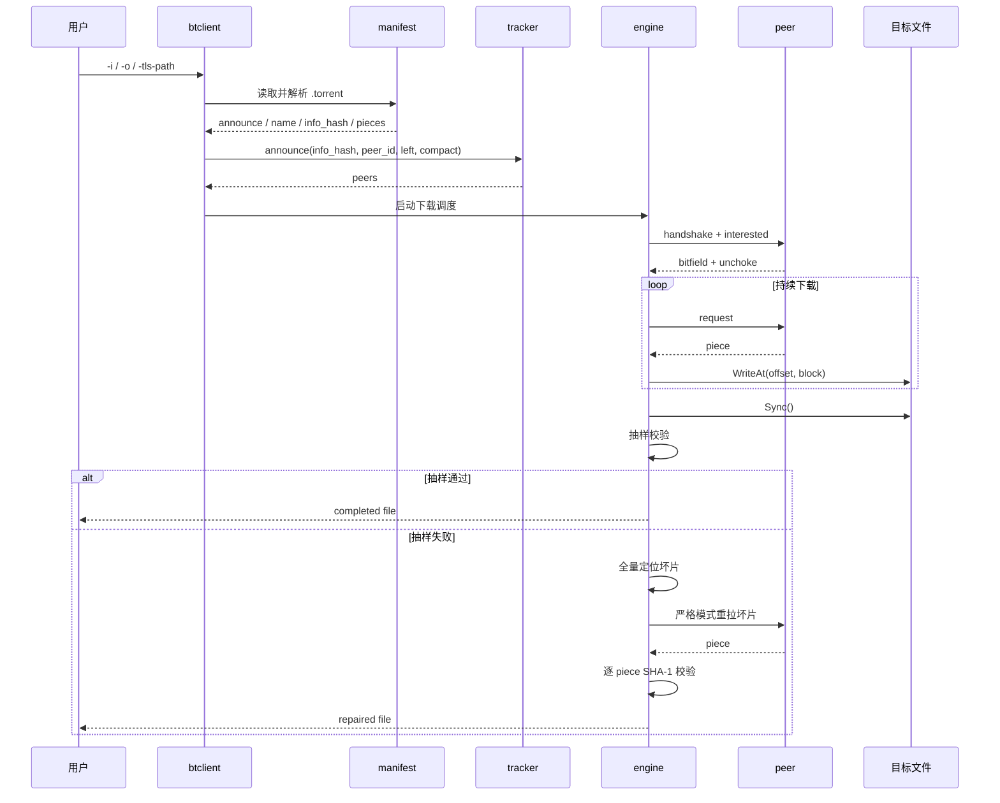

# bt-refractor

`bt-refractor` 是一个用 Go 从零实现的 BitTorrent 单文件下载客户端。当前仓库面向数据中心式部署环境做了取舍：优先保证下载链路简单、吞吐直接、运行稳定，同时保留在需要时切回更严格校验路径的能力。

编译后的二进制名称为 `btclient`。

## 1. 一眼看懂

### 1.1 下载总流程



### 1.2 模块关系



### 1.3 运行形态

```text
输入:
  .torrent 文件
  输出根路径
  可选 tracker 证书

处理:
  解析 torrent
  向 tracker announce
  与多个 peer 并发握手和收数
  直接写盘
  下载结束后做抽样校验

输出:
  以 torrent name 命名的目标文件
```

## 2. 当前能力

当前仓库已经覆盖一条完整的单文件 BT 下载闭环：

- 读取 `.torrent` 文件
- 解析单文件 torrent 的 `announce`、`info`、`name`、`length`、`piece length`、`pieces`
- 计算 `info_hash`
- 向 HTTP tracker 发起 announce
- 在提供证书时向 HTTPS tracker 发起安全请求
- 解析 compact peers
- 与 peer 建立 TCP 会话
- 完成 BitTorrent 握手
- 处理 `bitfield`、`interested`、`choke`、`unchoke`、`request`、`piece`、`have`
- 将下载数据直接写入目标文件
- 默认在下载结束后做抽样校验
- 在需要时按 piece 做 SHA-1 全量校验

当前明确不支持：

- magnet
- UDP tracker
- 多文件 torrent
- seeding / uploading
- DHT / PEX / 扩展协议

## 3. 命令行

命令行只保留 3 个参数：

- `-i`
  - `.torrent` 文件路径
- `-o`
  - 输出根路径
- `-tls-path`
  - tracker 安全请求使用的 PEM 证书路径

示例：

```bash
go build -o btclient ./cmd/btclient
./btclient -i /data/job/input.torrent -o /data/output
```

如果 torrent 的 `name` 是 `debian.iso`，最终文件路径就是：

```text
/data/output/debian.iso
```

如果 torrent 的 `name` 本身带相对子路径，例如 `images/debian.iso`，最终文件路径就是：

```text
/data/output/images/debian.iso
```

也就是说，`-o` 只提供输出根路径，最终文件名严格来自 torrent 元数据。

## 4. tracker 访问模式

tracker 访问有两种模式：

1. 普通模式
   - 不传 `-tls-path`
   - 只允许请求非 TLS tracker
   - 连接层使用普通 TCP 拨号
2. 安全模式
   - 传入 `-tls-path`
   - 读取 PEM 证书并建立 TLS 请求
   - 适用于 HTTPS tracker



因此：

- 没有证书时
  - 走非安全模式
- 传入证书时
  - 走安全模式

## 5. 数据中心默认策略

当前实现默认按“机房网络可信、吞吐优先，但可靠性优先级高于纯速度”的思路运行：

- 保持兼容性更好的 `16 KiB` request block
- 提高了每个 peer 的 request pipeline 深度
- 降低了空闲轮询等待
- 把高频 piece 成功日志改成批量进度日志
- 默认不在热路径上对每个 piece 做 SHA-1 校验
- 默认在下载结束后对一组分布式抽样 piece 做校验
- 抽样一旦发现异常，自动升级为全量校验并只重拉坏片
- 升级修复时强制打开逐 piece SHA-1 校验，并直接淘汰返回坏片的 peer


这样做的目的，是把 CPU 和日志 IO 尽量让给真实下载流量，但不是把可靠性完全让出去。当前仓默认走的是三层保障：

1. 热路径尽量快
   - 不在每个 piece 上做同步 SHA-1
   - 让更多 CPU 时间留给 socket 收发和写盘
2. 下载结束后先做低成本抽样
   - 快速判断“快路径里有没有明显坏片”
3. 只要抽样命中异常，就自动进入严格修复
   - 全量扫描磁盘上的所有 piece
   - 找出真正损坏的 piece 下标
   - 只重拉坏片，不重下整文件
   - 重拉阶段对每个 piece 强制做 SHA-1 校验
   - 返回坏片的 peer 会被直接断开，不再继续消耗修复轮次



这意味着当前仓的默认策略不是“发现坏了就失败”，而是“先快跑，发现异常后自动切回严格模式修复”。

这里有一个边界要说明清楚：

- torrent 的 `piece size` 是写死在 `.torrent` 元数据里的，下载端不能修改
- 下载端真正能调的是 request block 大小和在途请求窗口

当前默认没有把 request block 继续放大，是为了兼容更多 peer；真正的提速来自更大的在途窗口，而不是去修改 torrent 自带的 `piece size`。在数据中心里即使网络质量好，也仍然可能遇到个别 peer 行为异常或链路抖动，所以默认继续保留更稳的 `16 KiB` block，把优化重点放在：

- 更高的 pipeline 深度
- 更低的热路径校验开销
- 抽样失败后的严格修复链路

如果你要在更强调完整性的环境里运行，可以显式打开全量 piece 校验：

```bash
BTCLIENT_VERIFY_PIECES=1 ./btclient -i /data/job/input.torrent -o /data/output
```

如果你要继续手工调优数据中心吞吐，也可以通过环境变量调整：

```bash
BTCLIENT_PIPELINE_DEPTH=96 BTCLIENT_BLOCK_SIZE=16384 BTCLIENT_AUDIT_PIECES=48 BTCLIENT_REPAIR_ROUNDS=4 ./btclient -i /data/job/input.torrent -o /data/output
```

其中：

- `BTCLIENT_PIPELINE_DEPTH`
  - 控制每个 peer 的在途请求数
  - 是数据中心场景下最值得优先调的吞吐参数
- `BTCLIENT_BLOCK_SIZE`
  - 控制单个 `request` 的 block 大小
  - 默认保持 `16 KiB`，优先兼容性和丢包下的稳定性
- `BTCLIENT_AUDIT_PIECES`
  - 控制下载完成后的抽样覆盖面
  - 数值越大，抽样越保守
- `BTCLIENT_REPAIR_ROUNDS`
  - 控制自动修复轮数
  - 只在抽样失败后触发，对正常快路径没有额外成本

## 6. 一次下载在做什么

一次完整下载的执行路径如下：



文字版步骤：

1. `cmd/btclient` 读取参数并生成 `peer_id`
2. `internal/manifest` 解析 `.torrent`
3. 基于 torrent 的 `name` 计算最终输出文件路径
4. `internal/discovery` 向 tracker announce，得到 peers
5. `internal/engine` 为每个 peer 启动一个 worker
6. worker 完成握手，读取 bitfield，发送 `interested`
7. peer `unchoke` 之后，worker 按 pipeline 连续发送 `request`
8. peer 返回 `piece` 后，客户端下载 block 并按偏移拼装
9. 数据直接写入目标文件
10. 默认情况下，下载结束后会对一组抽样 piece 做校验
11. 如果抽样失败，系统会自动升级为全量校验，定位出坏片
12. 坏片会在严格模式下被定向重拉，并逐 piece 做 SHA-1 校验
13. 如果启用了 `BTCLIENT_VERIFY_PIECES=1`，则从一开始就对每个 piece 在写盘前做 SHA-1 校验
14. 全部 piece 完成后，下载结束

## 7. 仓库结构

```text
cmd/
  btclient/                CLI 入口
internal/
  bencode/                 最小 bencode 编解码
  manifest/                torrent 元数据解析
  discovery/               tracker announce / peers
  peerwire/                握手、消息帧、bitfield
  engine/                  调度、会话、写盘、校验
workflow_integration_test.go
                           fake tracker + fake peer 端到端测试
```

## 8. 协议要点

这个仓库只实现当前下载流程真正需要的 BitTorrent 子集：

### 8.1 `.torrent`

关心的字段只有：

- 根字典
  - `announce`
  - `info`
- `info` 字典
  - `name`
  - `length`
  - `piece length`
  - `pieces`

其中 `pieces` 是一串连续的 SHA-1 摘要，每 20 个字节对应一个 piece。

### 8.2 `info_hash`

计算方式是：

1. 取出 `info` 字典
2. 重新做 bencode 编码
3. 对编码结果做 SHA-1

tracker announce 和 peer 握手都依赖这个值。

### 8.3 tracker announce

当前使用的参数包括：

- `info_hash`
- `peer_id`
- `port`
- `uploaded`
- `downloaded`
- `left`
- `compact`

tracker 返回里当前只消费：

- `interval`
- `peers`
- `failure reason`

### 8.4 peer wire

握手之后，当前会处理这些消息：

- `bitfield`
- `interested`
- `choke`
- `unchoke`
- `request`
- `piece`
- `have`

下载过程中，worker 会在 peer 允许发送数据后持续保持多个 block request 在飞，以降低 RTT 对吞吐的影响。

## 9. 测试

当前测试覆盖包括：

- `internal/bencode`
  - bencode 编解码单元测试
- `internal/manifest`
  - torrent 解析、`info_hash`、piece span 单元测试
- `internal/discovery`
  - tracker announce、TLS 证书、HTTPS 限制、compact peers 单元测试
- `internal/peerwire`
  - 握手帧、消息帧、bitfield 单元测试
- `internal/engine`
  - piece 调度、peer 会话、抽样校验、坏片定位单元测试
- `workflow_integration_test.go`
  - 本地 fake tracker + fake peer 的端到端测试
  - 覆盖严格模式下载
  - 覆盖“快路径坏片 -> 抽样发现 -> 全量定位 -> 定向修复”的自动兜底路径

## 10. 文档

- [原始仓对比文档](docs/compare-with-original.md)
- [协议与功能详解](docs/protocol-and-features.md)
- [4+1 架构视图](docs/architecture-views.md)

## 11. License

本仓库使用 `0BSD`，属于极宽松协议。

它的含义可以简单理解为：

- 可商用
- 可修改
- 可分发
- 可私有集成
- 不要求署名
