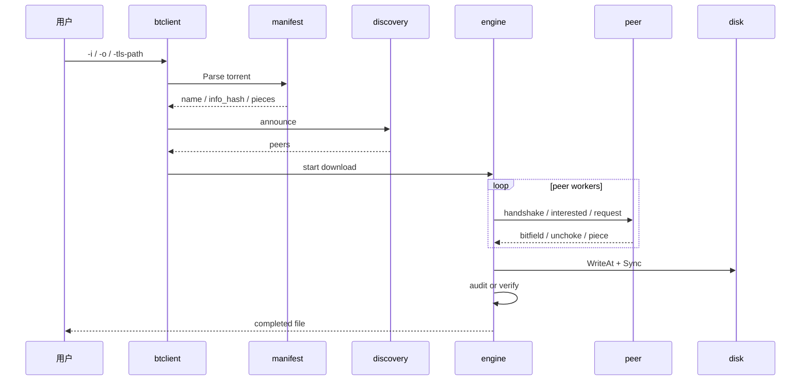
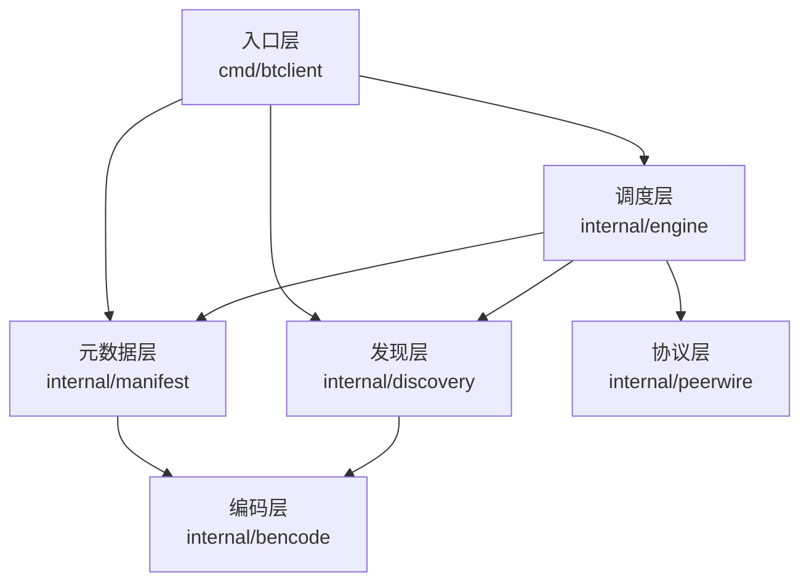
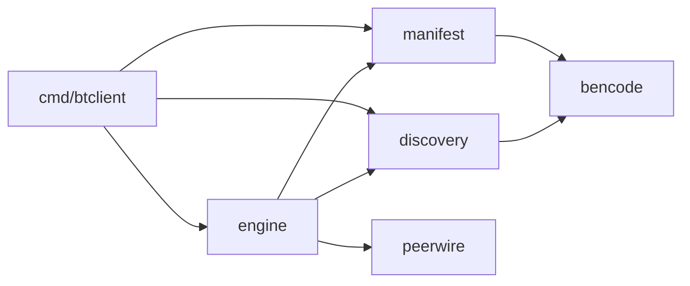
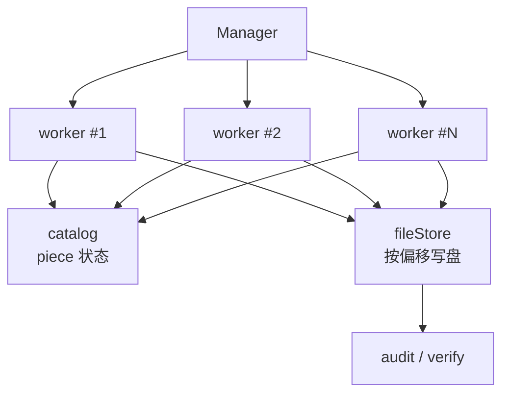
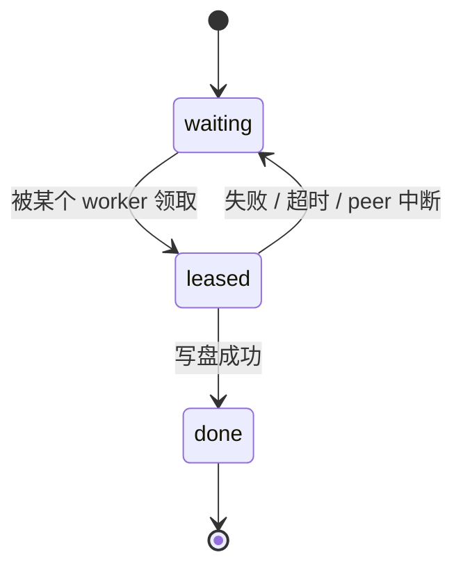
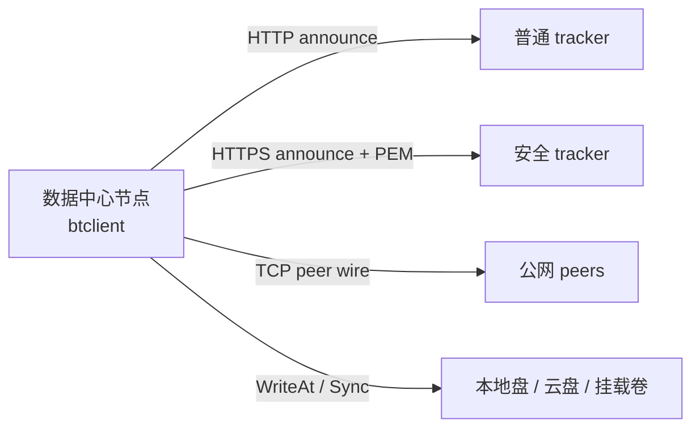

# 4+1 架构视图

本文档使用 4+1 视图来说明当前仓库的架构。这里的“+1”是核心下载场景，其余四个视角分别是：

- 逻辑视图
- 开发视图
- 进程视图
- 物理视图

## 1. +1 场景视图

这是最重要的主场景：用户给出 `.torrent`、输出根路径、可选证书，客户端下载并输出目标文件。



## 2. 逻辑视图

逻辑视图关心“系统由哪些逻辑块组成、它们分别负责什么”。



逻辑职责可以简化理解为：

- 入口层
  - 参数、环境变量、启动流程
- 元数据层
  - `.torrent` 解析与 `info_hash`
- 发现层
  - tracker announce 与 peers 解码
- 协议层
  - 握手、消息帧、bitfield
- 调度层
  - 并发 worker、piece 分配、写盘、校验
- 编码层
  - bencode 基础能力

## 3. 开发视图

开发视图关心“源码如何组织、包边界如何划分、依赖如何流动”。

### 3.1 目录视图

```text
cmd/
  btclient/
    entry.go
internal/
  bencode/
  manifest/
  discovery/
  peerwire/
  engine/
docs/
  compare-with-original.md
  protocol-and-features.md
  architecture-views.md
```

### 3.2 依赖方向



这个视角下最关键的是：

- `peerwire` 不反向依赖 `engine`
- `manifest` 和 `discovery` 通过 `bencode` 共享底层编码能力
- `cmd/btclient` 只负责装配，不承载协议细节

## 4. 进程视图

进程视图关心“运行时有哪些并发体、它们如何协作”。

### 4.1 运行时并发模型



### 4.2 piece 生命周期



这个视角里最重要的设计点是：

- `catalog` 只管理 piece 状态，不碰网络
- `peerSession` 只处理单 peer 协议交互，不碰全局调度
- `fileStore` 只负责按偏移写盘
- 校验被放在调度层收尾阶段，而不是散落在各层

## 5. 物理视图

物理视图关心“这个系统部署在什么位置、与外部世界如何连”。



这个视角下的重点不是花哨，而是两个边界：

- tracker 边界
  - 有证书才允许走 HTTPS tracker
- 存储边界
  - 下载数据直接落盘，不在内存里长期保留整文件

## 6. 四个视图怎么互相对应

```text
场景视图:
  回答“用户发起一次下载时系统怎么走”

逻辑视图:
  回答“系统被拆成哪些职责块”

开发视图:
  回答“这些职责块在代码里如何落位”

进程视图:
  回答“运行时 goroutine、共享状态、写盘如何协作”

物理视图:
  回答“程序与 tracker、peers、磁盘如何连接”
```

## 7. 为什么这套视图适合当前仓库

因为这个仓库的核心价值不是 UI，而是：

- 协议实现边界
- 模块拆分边界
- 下载调度边界
- 机房环境下的性能与可靠性折中

因此，4+1 视图能比单纯的 API 文档更快解释清楚：

- 为什么仓库这样拆
- 为什么默认策略是这样
- 为什么它和原始仓看起来不是同一套结构
