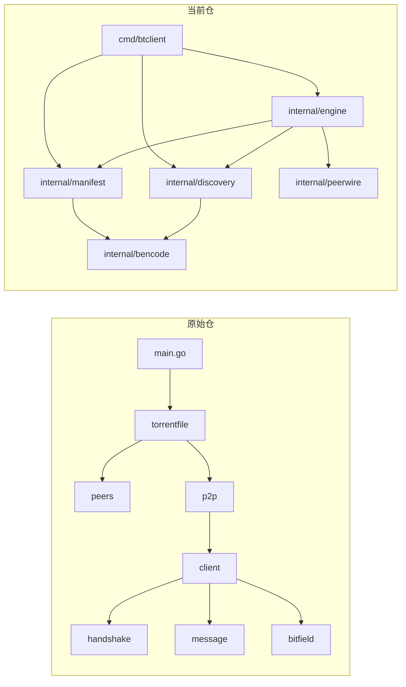
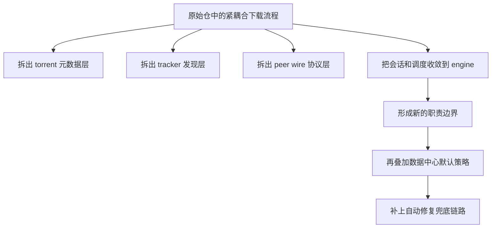
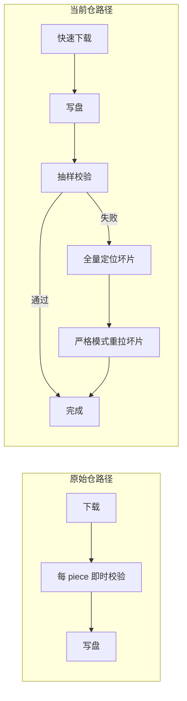
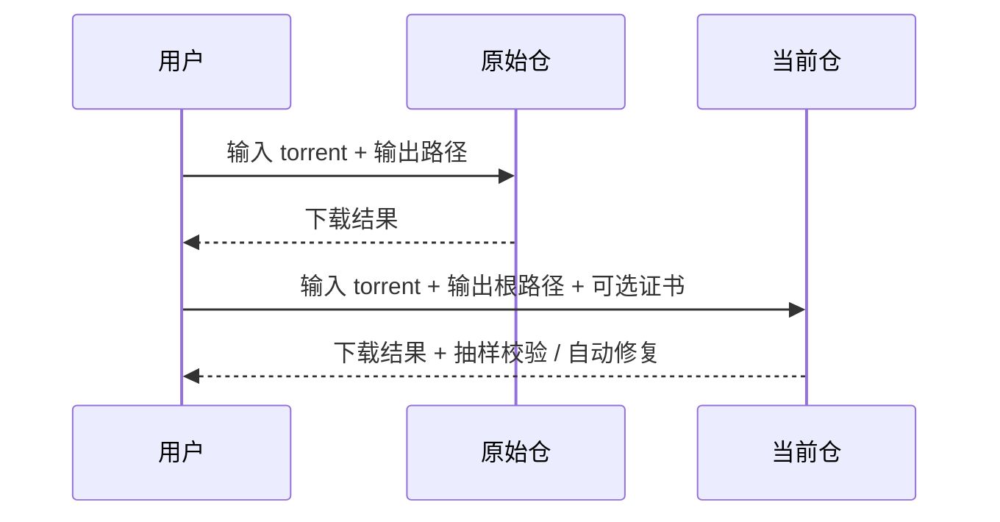
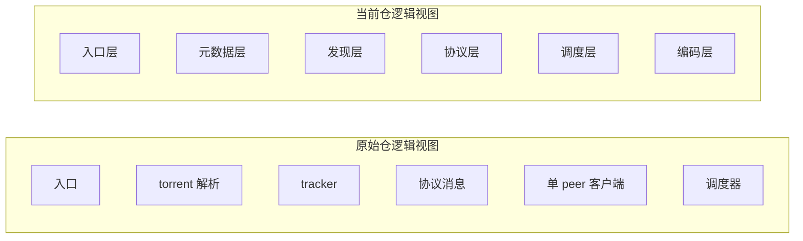
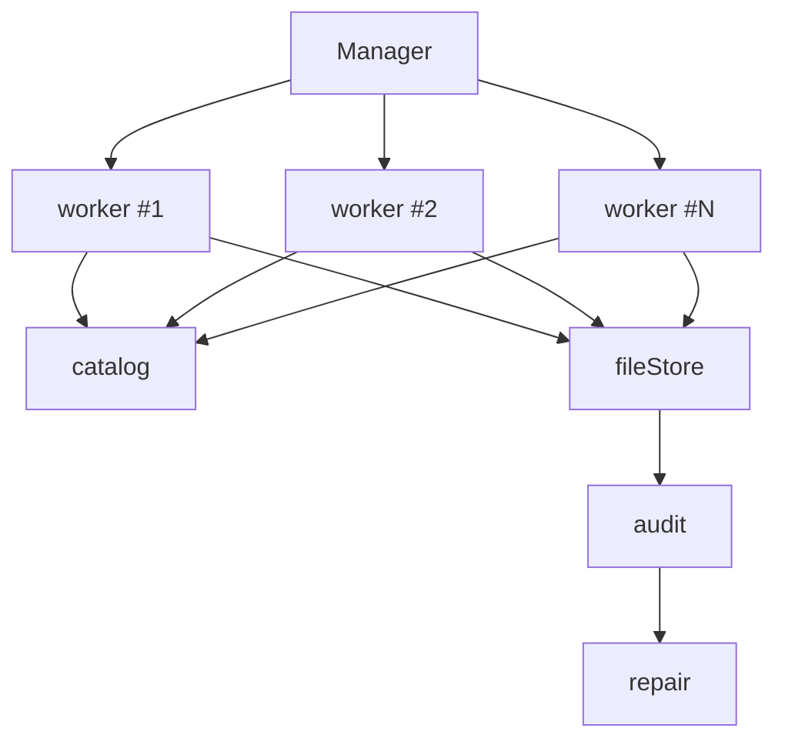
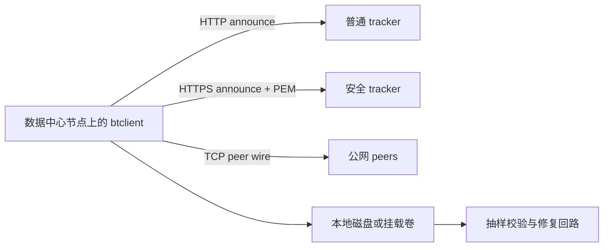

# 与原始仓的详细功能对照

本文档只讨论“原始仓”和“当前仓”的对应关系，不直接引用原始仓库名。重点不是说“都能下 BT”，而是把变化拆开讲清楚：

1. 原始仓的功能点在当前仓哪里
2. 当前仓为什么看起来像一套完全重新设计过的实现
3. 这些变化会带来什么工程和运行时效果

## 1. 先看全局变化

### 1.1 结构变化总图



### 1.2 一句话理解

```text
原始仓:
  入口、torrent 元数据、tracker、peer 地址、协议消息、单 peer 客户端、调度器
  以“功能可跑通”为中心组织

当前仓:
  入口、元数据、发现、协议、调度、编码器明确分层
  以“职责边界清晰 + 命名完全重建 + 数据中心默认策略”为中心组织
```

## 2. 总体结论

当前仓覆盖了原始仓已经具备的核心下载能力：

- 打开 `.torrent`
- 解析单文件 torrent
- 计算 `info_hash`
- 请求 tracker
- 解析 compact peers
- 与 peer 握手
- 接收 bitfield
- 发送 `interested`
- 处理 `choke / unchoke`
- 请求并接收 piece 数据
- 输出目标文件

在此基础上，当前仓还新增了两类能力或策略：

- tracker 证书模式
  - `-tls-path` 提供 PEM 证书后，允许请求 HTTPS tracker
- 数据中心快速路径
  - 默认提高 pipeline 深度
  - 默认保留 `16 KiB` request block 以保证 peer 兼容性
  - 默认关闭热路径的每 piece SHA-1 校验
  - 默认增加下载完成后的抽样校验
  - 抽样失败后自动升级为全量定位和坏片定向修复
  - 仍保留通过 `BTCLIENT_VERIFY_PIECES=1` 重新开启校验的能力

## 3. 变更重点

### 3.1 变更矩阵

| 维度 | 原始仓 | 当前仓 | 变化意义 |
| --- | --- | --- | --- |
| 命名 | 贴近传统教学实现命名 | 完全重建命名体系 | 一眼能看出不是同一套代码平移 |
| 目录组织 | 模块能跑通即可 | 入口、元数据、发现、协议、调度分层 | 依赖关系更清晰 |
| tracker | 普通 announce | 增加证书驱动的 TLS 访问策略 | 满足机房环境的安全接入 |
| 写盘路径 | 更偏向先收齐再输出 | 直接按偏移写盘 | 减少整文件内存驻留 |
| 校验策略 | 每 piece 即时校验 | 默认抽样校验，可切全量校验 | 更贴合数据中心吞吐优先场景 |
| 失败兜底 | 更偏向直接报错或人工重试 | 抽样失败后自动全量扫描、严格重拉坏片、淘汰坏 peer | 更适合生产环境的稳定性要求 |
| 输出路径 | 更接近目标文件路径 | `-o` 是输出根路径，文件名来自 torrent | 与批处理环境更一致 |

### 3.2 原始仓到当前仓的重构思路



### 3.3 数据中心策略差异图



这里最关键的变化不是“当前仓更激进”，而是“当前仓把严格校验从热路径后移到了异常路径”，因此吞吐和兜底都还保留着。

## 4. 目录级映射

| 原始仓模块 | 原始仓职责 | 当前仓对应模块 | 当前仓说明 |
| --- | --- | --- | --- |
| `main.go` | CLI 入口，读取参数并触发下载 | `cmd/btclient/entry.go` | 入口职责对应，但参数语义和输出路径规则不同 |
| `torrentfile` | `.torrent` 解析、tracker 请求、下载入口 | `internal/manifest` + `internal/discovery` + `cmd/btclient` | 当前仓把元数据、tracker、入口拆成三层 |
| `peers` | compact peers 解码 | `internal/discovery` | 当前仓把 peer 地址解码收敛进发现层 |
| `handshake` | 握手编解码 | `internal/peerwire/hello.go` | 功能对应，但对象命名改成 `Greeting` |
| `message` | peer 消息编解码 | `internal/peerwire/frames.go` | 功能对应，但统一使用 `Packet` 概念 |
| `bitfield` | piece 位图操作 | `internal/peerwire/availability.go` | 功能对应，但命名改成 `Bitmap` |
| `client` | 单 peer 连接与消息收发 | `internal/engine/peerlink.go` | 当前仓把会话逻辑并入下载引擎 |
| `p2p` | 多 peer 下载调度 | `internal/engine/downloader.go` | 功能对应，但调度、写盘和校验策略不同 |

## 5. 文件级对应

### 5.1 CLI 层

| 原始仓文件/职责 | 当前仓文件/职责 | 对应关系 |
| --- | --- | --- |
| `main.go`：读取命令行并调用下载 | `cmd/btclient/entry.go`：读取 `-i`、`-o`、`-tls-path` 并启动下载 | 都是入口，但当前仓把输出路径定义成“输出根路径”，最终文件名来自 torrent `name` |

### 5.2 torrent 元数据层

| 原始仓文件/函数 | 当前仓文件/函数 | 对应关系 |
| --- | --- | --- |
| `torrentfile/torrentfile.go` | `internal/manifest/reader.go` | 都负责把 `.torrent` 转成强类型结构 |
| `Open` | `Load` | 都负责读取 torrent 文件 |
| `toTorrentFile` | `Parse` | 都负责把 bencode 数据解成下载需要的字段 |
| `splitPieceHashes` | `splitDigests` | 都负责把 `pieces` 切成 20 字节一组 |

### 5.3 tracker 层

| 原始仓文件/函数 | 当前仓文件/函数 | 对应关系 |
| --- | --- | --- |
| `torrentfile/tracker.go` | `internal/discovery/http_tracker.go` | 都负责 announce 请求和响应解析 |
| `buildTrackerURL` | `BuildURL` | 都负责拼装 announce URL |
| `requestPeers` | `HTTPClient.Announce` | 都负责请求 tracker 并返回 peers |
| 无 | `NewWithOptions` | 当前仓新增，用于区分普通 TCP 模式和证书 TLS 模式 |

### 5.4 peer 地址层

| 原始仓文件/函数 | 当前仓文件/函数 | 对应关系 |
| --- | --- | --- |
| `peers/peers.go` | `DecodeCompactPeers` | 都负责把 compact peers 二进制数据解成地址列表 |

### 5.5 握手层

| 原始仓文件/函数 | 当前仓文件/函数 | 对应关系 |
| --- | --- | --- |
| `handshake/handshake.go` | `internal/peerwire/hello.go` | 都负责握手帧的构造和解析 |
| `handshake.New` | `peerwire.NewGreeting` | 功能对应 |
| `handshake.Read` | `peerwire.ReadGreeting` | 功能对应 |

### 5.6 消息层

| 原始仓文件/函数 | 当前仓文件/函数 | 对应关系 |
| --- | --- | --- |
| `message/message.go` | `internal/peerwire/frames.go` | 都负责 peer 消息编解码 |
| `ParsePiece` | `CopyBlock` | 都负责从 `piece` 消息中取出 block 并写入缓冲区 |
| `FormatRequest` 等消息构造 | `RequestPacket` / `HavePacket` / `InterestedPacket` | 功能对应，但命名体系不同 |

### 5.7 bitfield 层

| 原始仓文件/函数 | 当前仓文件/函数 | 对应关系 |
| --- | --- | --- |
| `bitfield/bitfield.go` | `internal/peerwire/availability.go` | 都负责查询和设置 piece 位 |

### 5.8 单 peer 会话层

| 原始仓文件/函数 | 当前仓文件/函数 | 对应关系 |
| --- | --- | --- |
| `client/client.go` | `internal/engine/peerlink.go` | 都负责建立 peer 会话、完成握手、处理消息 |
| `completeHandshake` | `establishSession` | 都负责完成会话起始阶段 |
| `SendInterested` / `SendRequest` | `writePacket` + `InterestedPacket` / `RequestPacket` | 当前仓把“构造消息”和“写出消息”拆开了 |

### 5.9 多 peer 调度层

| 原始仓文件/函数 | 当前仓文件/函数 | 对应关系 |
| --- | --- | --- |
| `p2p/p2p.go` | `internal/engine/downloader.go` | 都负责并发调度多个 peer 下载 |
| `checkIntegrity` | `VerifyPieces` 为 `true` 时的 piece SHA-1 校验路径 | 当前仓把完整性校验变成可选策略 |

## 6. 4+1 视角下的差异

### 6.1 场景视图

同一个“下载一个 torrent 文件”的场景，当前仓比原始仓多了两条显式能力线：

- 输出根路径 -> 最终文件名来自 torrent `name`
- tracker 证书模式



### 6.2 逻辑视图

原始仓更像一条顺着功能往下走的链。当前仓则更像一个清晰分层的系统。



### 6.3 开发视图

当前仓的源码组织更接近“可维护的包边界”，而不是“把协议和下载逻辑糅在一起”。

```text
原始仓:
  main
  torrentfile
  peers
  handshake
  message
  bitfield
  client
  p2p

当前仓:
  cmd/btclient
  internal/bencode
  internal/manifest
  internal/discovery
  internal/peerwire
  internal/engine
```

### 6.4 进程视图

进程模型的关键变化不是“有没有并发”，而是“并发实体之间如何共享状态，以及失败后如何自动修复”。



当前仓里：

- `catalog` 只负责 piece 状态
- `fileStore` 只负责按偏移写盘
- `peerSession` 只负责单 peer 协议交互
- `audit` 负责快路径收尾
- `repair` 负责抽样失败后的严格修复

因此锁粒度和职责更明确。

### 6.5 物理视图

物理部署上的关键差异是 tracker 安全接入。



## 7. 最重要的行为差异

### 7.1 输出路径

```text
原始仓倾向:
  用户传什么目标文件路径，就写到哪里

当前仓:
  用户只给输出根路径
  最终文件名与相对子路径来自 torrent 的 name
```

### 7.2 校验策略

```text
原始仓:
  每 piece 即时 SHA-1 校验

当前仓:
  默认热路径不做每 piece 校验
  下载结束后做抽样校验
  抽样失败后自动全量定位和定向修复
  需要时也可切到全量逐 piece 校验
```

### 7.3 tracker 访问

```text
原始仓:
  传统 announce 模式

当前仓:
  announce 模式 + 显式证书驱动的 TLS 访问规则
```

## 8. 结论

如果只看功能覆盖，当前仓已经能在不依赖原始命名和结构的前提下，完整跑通原始仓的核心单文件 BT 下载能力。

如果看工程实现，当前仓和原始仓的差异主要体现在：

- 分层更细
- 命名完全重建
- tracker 安全模式独立设计
- 输出路径规则重写
- 默认性能策略改成数据中心快速路径
- 在数据中心快速路径上额外补了自动修复兜底
- 文档化表达从“代码说明”升级为“架构视图 + 对照矩阵 + 场景流程”
