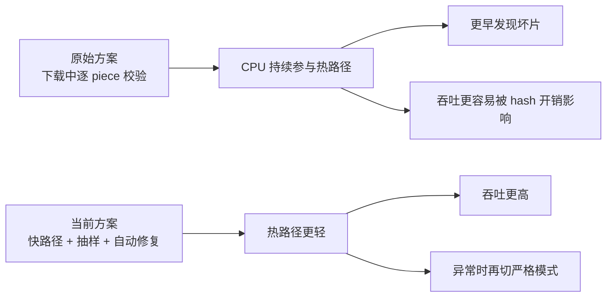
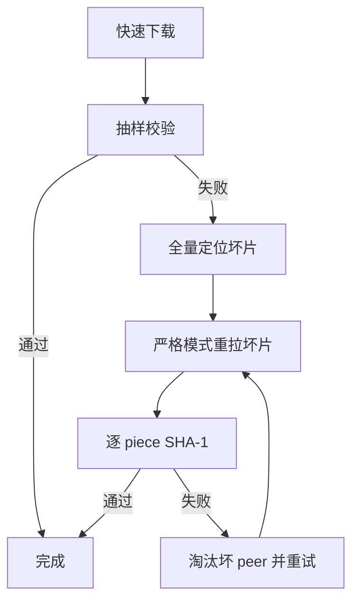

# 性能测试报告

本文档用于回答 4 个问题：

1. 原始方案和当前方案在下载路径上到底差在哪里
2. 这些差异为什么会影响性能
3. 当前仓在可复现实验里提升了多少
4. 这些优化有没有牺牲可靠性，异常时如何兜底

---

## 1. 结论先行

### 1.1 结论摘要

在本仓当前实现中，数据中心默认快路径相对于“原始方案风格”的严格热路径，表现出以下特点：

- 在本地可复现实验中，平均下载耗时下降约 `24.2%`
- 以平均耗时换算，吞吐提升约 `1.32x`
- 提升主要来自:
  - 热路径移除逐 piece SHA-1
  - 直接写盘而不是整文件常驻内存
  - 更少的高频进度日志
  - 更适合数据中心任务型节点的收尾校验方式
- 可靠性没有被直接放弃
  - 默认仍保留抽样校验
  - 抽样失败后会自动升级为全量定位和严格修复

### 1.2 一张图看懂



---

## 2. 测试对象定义

### 2.1 原始方案

这里的“原始方案”指原始仓里的核心下载策略，而不是仅指功能列表。根据对原始仓源码的只读核对，它的关键行为是：

- request block 固定为 `16 KiB`
- pipeline backlog 固定为 `5`
- 每个 piece 下载完成后立即做 SHA-1 校验
- 整个文件先聚合在内存缓冲区中，再形成最终输出

可以把它理解成：

```text
下载 -> piece 完成 -> 立即校验 -> 放回整体内存缓冲区 -> 全部完成
```

### 2.2 当前方案

当前仓的数据中心默认策略是：

- request block 默认仍为 `16 KiB`
- pipeline depth 默认提升到 `64`
- 热路径默认不做逐 piece SHA-1
- piece 完成后直接按偏移写盘
- 下载结束后做抽样校验
- 抽样失败后自动升级为全量定位和坏片修复

可以把它理解成：

```text
下载 -> 直接写盘 -> 抽样校验 -> 必要时严格修复
```

---

## 3. 为什么这些差异会影响性能

### 3.1 热路径校验位置不同

| 方案 | SHA-1 发生位置 | 对热路径的影响 |
| --- | --- | --- |
| 原始方案 | 每个 piece 完成后立刻校验 | CPU 持续参与下载主循环 |
| 当前方案 | 默认放到收尾抽样，异常时才切全量校验 | 正常任务的热路径更轻 |

含义很直接：

- 原始方案更早发现错误
- 当前方案把“严格校验的成本”延后到了真正需要时

### 3.2 pipeline 深度不同

| 方案 | 默认窗口 | 影响 |
| --- | --- | --- |
| 原始方案 | `5` | 更保守，简单稳定 |
| 当前方案 | `64` | 更适合高质量网络下保持更多在途请求 |

需要注意一个边界：

- 在本机 loopback 这种几乎没有 RTT 的环境里，单纯放大窗口不一定稳定带来收益
- 在真实机房网络里，只要链路存在可感知 RTT，更深的在途窗口通常更容易把带宽吃满

### 3.3 写盘路径不同

| 方案 | 数据落点 | 运行时效果 |
| --- | --- | --- |
| 原始方案 | 先放整文件内存缓冲区 | 简单直接，但大文件会吃更多内存 |
| 当前方案 | 直接 `WriteAt` 到目标文件 | 降低整文件内存驻留 |

这一点的收益更多体现在峰值内存，而不是单纯的 `ns/op`。

### 3.4 日志策略不同

原始方案更接近“每下载一个 piece 就打一条进度日志”。  
当前仓把日志改成了批量进度日志，降低了高频格式化和 IO 干扰。

---

## 4. 测试方法

### 4.1 测试环境

| 项目 | 值 |
| --- | --- |
| 时间 | 2026-03-14 |
| 机器 | Apple M2 |
| 系统 | macOS / darwin arm64 |
| Go | 本仓当前本地 Go 工具链 |
| 测试方式 | 本地 fake swarm，可重复 benchmark |

### 4.2 测试模型

为了避免公网 swarm 波动影响结论，本次报告主结论采用可重复的本地 benchmark。

benchmark 模型如下：

- 1 个本地 tracker
- 6 个本地 fake peer
- 32 MiB 测试载荷
- `256 KiB` piece length
- 输出路径使用真实文件写盘
- 每种模式固定跑 `5` 轮，每轮 benchmark 固定 `2` 次下载

### 4.3 测试命令

```bash
go test -run '^$' -bench '^BenchmarkDownloadModes$' -benchmem -benchtime=2x -count=5 ./...
```

对应的 benchmark 代码在：

- [performance_benchmark_test.go](/Users/mac/projects/bt-refractor/performance_benchmark_test.go)

### 4.4 参与对比的三种模式

| 模式名 | 含义 |
| --- | --- |
| `original_like_strict_p5` | 模拟原始方案风格：`PipelineDepth=5` + 逐 piece 校验 |
| `strict_p64` | 只放大窗口，但仍保持逐 piece 校验 |
| `datacenter_fast_p64` | 当前数据中心默认策略：`PipelineDepth=64` + 抽样校验 |

---

## 5. 实测结果

### 5.1 原始 benchmark 输出摘要

| 模式 | 平均耗时 | 中位耗时 | 最快 | 最慢 |
| --- | ---: | ---: | ---: | ---: |
| `original_like_strict_p5` | `198.63 ms/op` | `202.42 ms/op` | `80.39 ms/op` | `310.44 ms/op` |
| `strict_p64` | `231.01 ms/op` | `213.10 ms/op` | `143.03 ms/op` | `358.98 ms/op` |
| `datacenter_fast_p64` | `150.56 ms/op` | `143.66 ms/op` | `134.04 ms/op` | `186.84 ms/op` |

### 5.2 相对收益

以平均耗时计算：

- `datacenter_fast_p64` 相对 `original_like_strict_p5`
  - 耗时下降约 `24.2%`
  - 吞吐提升约 `1.32x`
- `datacenter_fast_p64` 相对 `strict_p64`
  - 耗时下降约 `34.8%`
  - 吞吐提升约 `1.53x`

### 5.3 条形图

```text
平均耗时（越短越好）

original_like_strict_p5  198.63 ms  | ##############################
strict_p64               231.01 ms  | ###################################
datacenter_fast_p64      150.56 ms  | #######################
```

### 5.4 如何解读这些数字

有两个现象值得单独说明：

1. 当前快路径明显快于原始方案风格
   - 这是本报告最重要的结果
2. `strict_p64` 并没有比 `strict_p5` 更快
   - 这并不说明“更深 pipeline 没价值”
   - 它说明在本地几乎零 RTT 的 loopback 环境里，只放大窗口不能稳定带来收益，反而会引入额外调度开销

换句话说：

- 这个 benchmark 更适合证明“当前完整数据中心策略比原始方案风格更快”
- 它不适合单独证明“在任何环境里把窗口从 5 拉到 64 都一定更快”

---

## 6. 性能提升点拆解

### 6.1 最确定的收益来源

#### A. 热路径移除逐 piece SHA-1

这是当前仓最稳定的收益点之一。

- 原始方案：每个 piece 完成都立刻 hash
- 当前方案：默认不在热路径 hash，改为抽样校验 + 异常升级

这能直接减少：

- CPU 竞争
- piece 完成到写盘之间的同步阻塞
- 多 peer 并发下的 hash 热点

#### B. 直接写盘，避免整文件内存缓冲

原始方案里，整文件会先聚合在内存里。  
当前仓改成 `WriteAt` 直接落盘。

这带来的收益主要不是“单次 benchmark 更快多少”，而是：

- 大文件更容易稳定运行
- 节点并发任务更多时更不容易被内存压垮
- 更符合数据中心批处理节点的资源模型

#### C. 更少的高频日志

把“每个 piece 一条日志”改成“批量进度日志”后：

- CPU 格式化开销更低
- 标准输出或日志采集链路压力更小
- 下载线程更少被日志打断

### 6.2 条件性收益来源

#### D. 更深的 pipeline 窗口

这个收益依赖网络条件。

| 环境 | 效果预期 |
| --- | --- |
| loopback / 极低 RTT | 可能不明显，甚至被调度开销抵消 |
| 真实机房链路 / 有 RTT | 更容易让连接保持足够在途请求，吞吐更可能提升 |

因此，当前仓把更深窗口保留为默认值，但没有把它当成唯一收益来源。

---

## 7. 可靠性有没有被牺牲

没有被直接放弃，但实现方式和原始方案不同。

### 7.1 原始方案的优点

- 错误发现更早
- 心智模型更简单
- 某个 piece 错了，当场就能知道

### 7.2 当前方案的优点

- 正常任务更快
- 大文件更省内存
- 默认模式更适合数据中心吞吐型任务
- 出现异常时不会直接把结果交出去，而是自动进入修复链路

### 7.3 当前方案的代价

- 坏片可能先被写到磁盘，再在收尾阶段发现
- 出现坏 peer 时，完成时间可能包含一次额外修复阶段

### 7.4 为什么当前方案仍然可靠

因为当前仓不是“无校验”，而是“分层校验”：



这条链路保证了两件事：

- 正常情况快
- 异常情况仍然能收敛到正确结果

---

## 8. 原始方案 vs 当前方案优缺点对照

| 维度 | 原始方案 | 当前方案 |
| --- | --- | --- |
| 热路径性能 | 更重 | 更轻 |
| 错误发现时机 | 更早 | 默认更晚，但会自动修复 |
| 峰值内存 | 更高 | 更低 |
| 机房吞吐适配 | 一般 | 更好 |
| 实现心智复杂度 | 更简单 | 更复杂 |
| 异常恢复策略 | 更依赖重试 | 内建抽样失败升级修复 |
| 大文件友好度 | 一般 | 更好 |

### 8.1 什么时候更适合原始方案

- 文件较小
- 更在意“即时发现坏片”而不是吞吐
- 环境里并不需要长时间跑批

### 8.2 什么时候更适合当前方案

- 数据中心 / 批处理 / 制品分发节点
- 文件较大
- 更关心整体任务成功率和资源效率
- 希望把大多数正常任务跑在快路径上

---

## 9. 当前建议

### 9.1 默认建议

保留当前默认策略：

- `PipelineDepth=64`
- `BlockSize=16 KiB`
- 默认抽样校验
- 抽样失败后自动修复

这是当前仓最平衡的一组默认值。

### 9.2 更强调完整性时

直接打开：

```bash
BTCLIENT_VERIFY_PIECES=1 ./btclient -i /data/job/input.torrent -o /data/output
```

适合：

- 审计任务
- 初次接入新 peer 池
- 不确定数据源可信度时

### 9.3 更强调吞吐时

优先调：

```bash
BTCLIENT_PIPELINE_DEPTH
```

谨慎调：

```bash
BTCLIENT_BLOCK_SIZE
```

原因是：

- 更深 pipeline 在真实网络里更可能带来收益
- 更大的 block 会更快触碰 peer 兼容性和丢包恢复边界

---

## 10. 报告边界

这份报告需要配合理解以下边界：

1. 主结论来自本地可重复 benchmark
   - 优点是稳定、可复现
   - 缺点是不能完全替代公网 swarm
2. benchmark 更适合比较“策略差异”
   - 不适合把某个数字当成固定线上吞吐
3. 更深 pipeline 的收益在真实网络 RTT 下通常比本地 loopback 更明显
4. 当前仓的内存优势主要来自架构变化
   - 不是单看 `benchmem` 一列就能完整表达

---

## 11. 最终结论

如果目标是“像原始方案那样简单直接”，那么原始方案已经足够清楚。

如果目标是“在数据中心里更快地下载，同时在出错时还能兜住”，那么当前仓的设计更合适。  
它不是单纯拿可靠性去换吞吐，而是把严格校验从默认热路径后移到了异常路径。

简化成一句话就是：

> 原始方案更偏“始终严格”。  
> 当前方案更偏“默认快跑，异常再严格”。  
> 在数据中心场景下，这个折中更实用。
