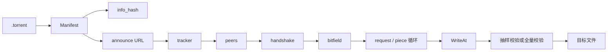
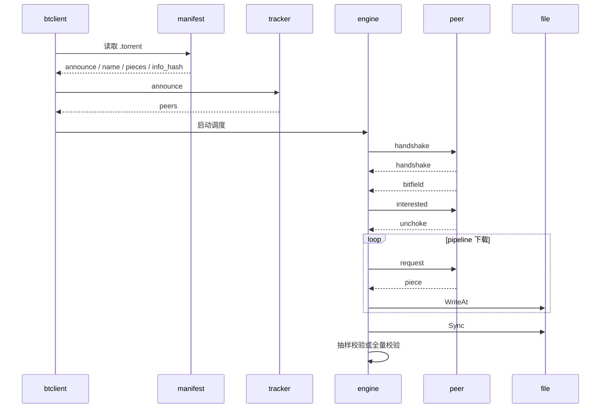
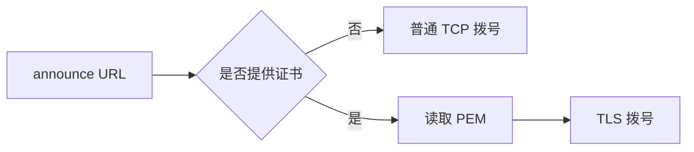
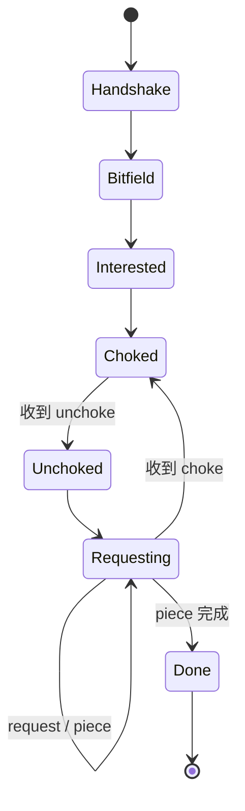
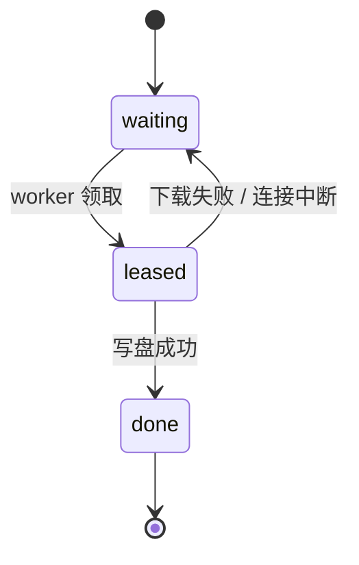
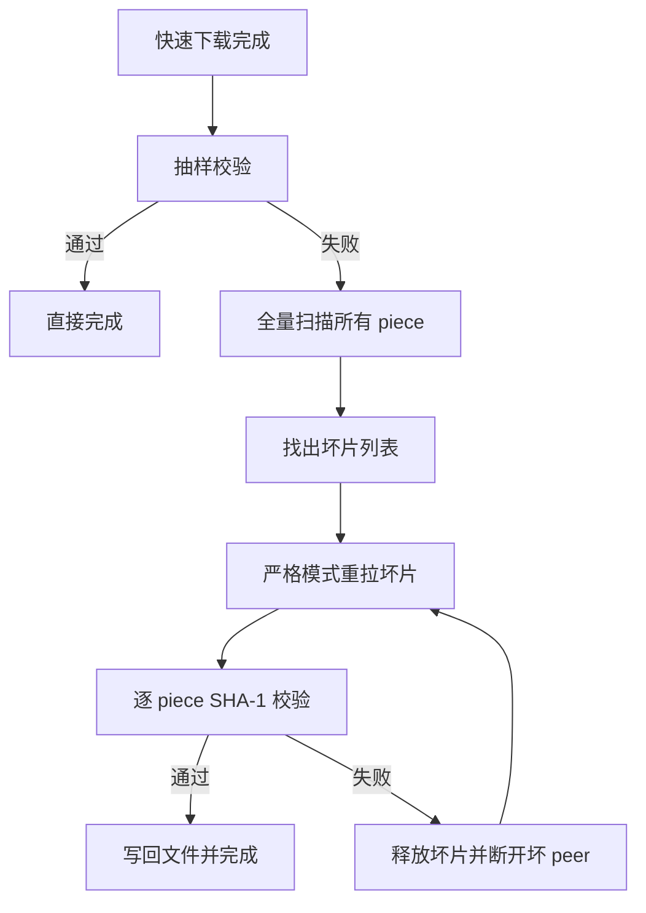
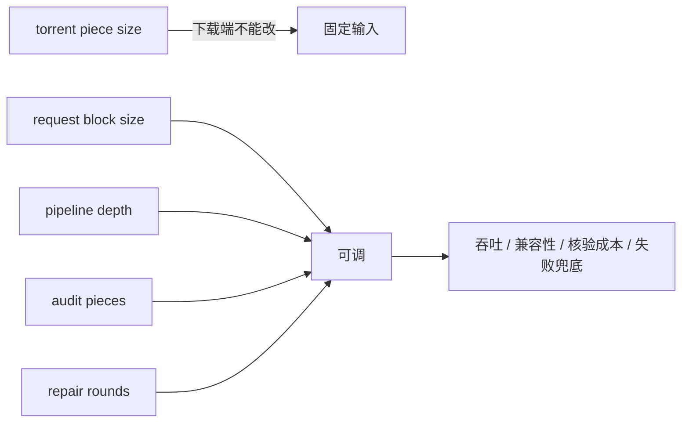

# 协议与功能详解

本文档用于快速说明这个仓库到底在做什么、协议上实现了哪些内容、为什么默认行为会偏向数据中心环境。

## 1. 协议主线

### 1.1 从 `.torrent` 到目标文件



### 1.2 时序图



## 2. 功能分层

### 2.1 `internal/bencode`

这一层提供最小 bencode 能力：

- 解析整数
- 解析字节串
- 解析列表
- 解析字典
- 将这些值重新编码

`.torrent` 本身和 tracker 响应都依赖这一层。

### 2.2 `internal/manifest`

这一层负责 torrent 元数据解析。

它把 `.torrent` 变成 `Manifest`，其中最关键的字段有：

- `Announce`
- `Name`
- `TotalLength`
- `StandardPieceLength`
- `PieceDigests`
- `InfoHash`

### 2.3 `internal/discovery`

这一层负责 peer 发现。

它负责：

1. 组装 announce URL
2. 请求 tracker
3. 解析 tracker bencode 响应
4. 解 compact peers

### 2.4 `internal/peerwire`

这一层负责 BitTorrent peer wire 协议的消息格式。

它定义了：

- 握手帧 `Greeting`
- 普通消息帧 `Packet`
- bitfield 位图 `Bitmap`

### 2.5 `internal/engine`

这一层是下载调度核心。

它负责：

- 建立 peer 会话
- 管理 piece 领取和归还
- 按 pipeline 连续请求 block
- 收集 piece 数据
- 可选做 SHA-1 校验
- 写盘

## 3. 输出路径规则

命令行里：

- `-o` 只表示输出根路径

最终文件名不由命令行给出，而是直接取 torrent `name`。

因此：

```text
btclient -i /jobs/a.torrent -o /data/out
```

如果 torrent 的 `name` 是 `release.iso`，结果就是：

```text
/data/out/release.iso
```

如果 torrent 的 `name` 是 `images/release.iso`，结果就是：

```text
/data/out/images/release.iso
```

为了不让 torrent 元数据跳出输出根路径，当前实现会拒绝绝对路径和 `..` 路径穿越。

## 4. `.torrent` 协议细节

### 4.1 根字典

当前实现只消费：

- `announce`
- `info`

### 4.2 `info` 字典

当前实现只支持单文件模式，因此只消费：

- `name`
- `length`
- `piece length`
- `pieces`

如果 `info` 中出现 `files`，当前实现会直接判定为多文件 torrent，不继续执行。

### 4.3 `pieces`

`pieces` 是连续的 SHA-1 摘要字节串，不是普通文本。

规则是：

- 每 20 个字节表示一个 piece 的 SHA-1
- piece 总数等于 `len(pieces) / 20`

### 4.4 `info_hash`

`info_hash` 的计算方式是：

1. 取出 `info` 字典
2. 对 `info` 重新做 bencode 编码
3. 对编码结果做 SHA-1

tracker announce 和 peer 握手都依赖它。

## 5. tracker 协议细节

### 5.1 announce 参数

当前实现会带上这些参数：

- `info_hash`
- `peer_id`
- `port`
- `uploaded`
- `downloaded`
- `left`
- `compact`

语义分别是：

- `info_hash`
  - 当前 torrent 的唯一标识
- `peer_id`
  - 当前客户端标识
- `port`
  - 当前客户端对外声称的端口
- `uploaded`
  - 已上传字节数
- `downloaded`
  - 已下载字节数
- `left`
  - 剩余未完成字节数
- `compact`
  - 请求 tracker 用 compact 格式返回 peers

### 5.2 tracker 返回

当前实现只消费：

- `interval`
- `peers`
- `failure reason`

### 5.3 普通模式与安全模式

tracker 请求分成两类：

1. 普通模式
   - 不提供 `-tls-path`
   - 使用普通 TCP 拨号
   - 仅允许非 HTTPS tracker
2. 安全模式
   - 提供 `-tls-path`
   - 读取 PEM 证书
   - 通过 TLS 拨号访问 HTTPS tracker



这条规则保证了“有证书走安全模式，没有证书走非安全模式”。

## 6. peer 握手细节

握手帧格式是：

```text
<pstrlen><pstr><reserved><info_hash><peer_id>
```

其中：

- `pstr`
  - 固定为 `BitTorrent protocol`
- `reserved`
  - 8 字节保留位
- `info_hash`
  - 当前 torrent 标识
- `peer_id`
  - 当前 peer 标识

当前实现会在握手后立即检查：

- 对端返回的 `info_hash` 是否一致

如果不一致，连接直接失败。

## 7. peer wire 消息细节

当前实现会处理这些消息：

- `bitfield`
- `interested`
- `choke`
- `unchoke`
- `request`
- `piece`
- `have`

### 7.1 消息推进关系



### 7.2 下载过程中最关键的动作

1. 先读取对端 bitfield
2. 发送 `interested`
3. 等待 `unchoke`
4. 连续发送多个 `request`
5. 读取 `piece`
6. 将 block 拷入目标 piece 缓冲区

## 8. piece 调度细节

当前实现中的调度由 `catalog` 管理。

每个 piece 只有 3 种状态：

- `waiting`
- `leased`
- `done`



流程是：

1. worker 只从当前 peer 已拥有的 piece 中领取任务
2. 领取后状态从 `waiting` 变为 `leased`
3. 下载失败时，piece 放回 `waiting`
4. 下载成功并写盘后，状态变为 `done`

## 9. 数据中心默认性能策略

当前仓库默认假设部署环境满足两点：

- peer 相对可信
- 吞吐很重要，但可靠性优先级更高

因此默认策略是：

- 保持 `16 KiB` request block
- 更高的 request pipeline 深度
- 更短的空闲等待
- 更少的高频日志
- 默认关闭热路径的每 piece SHA-1 校验
- 下载结束后做抽样 piece 校验
- 抽样一旦失败，自动升级为全量校验
- 只重拉被确认损坏的 piece
- 修复阶段强制打开逐 piece SHA-1 校验
- 修复阶段如果 peer 返回坏片，会被直接断开

这样做的收益是：

- 降低 CPU 消耗
- 降低日志 IO
- 提高多 peer 并发下的有效吞吐
- 仍保留完整的失败兜底链路

### 9.1 为什么没有默认放大 block

这里要特别区分两件事：

1. torrent 的 `piece size`
   - 由制种时决定
   - 下载端不能修改
2. request block 大小
   - 由下载端控制
   - 可以影响每个 `request` 消息承载多少字节

当前实现没有继续默认放大 request block，而是优先扩大在途请求窗口。原因是：

- 这比“直接把单个 request 做大”更兼容现网 peer
- 在 TCP 传输下，对高质量网络更有效的往往是足够的在途字节数
- 在有少量丢包时，保留较小 request block 更稳妥

### 9.2 数据中心失败兜底链路

默认模式下，并不是“抽样失败就直接报错退出”，而是会进入自动修复。



这个修复链路的含义是：

1. 热路径优先吞吐
2. 收尾阶段先用低成本抽样快速发现问题
3. 真发现问题时，不靠猜，而是全量扫描整文件定位真实损坏位置
4. 修复时只重拉坏片，不重下整文件
5. 修复阶段切到严格模式，对每个坏片做 SHA-1
6. 返回坏片的 peer 会被直接淘汰，避免卡在同一个坏 peer 上反复领取同一片

### 9.3 失败兜底比单纯全量校验更适合机房

如果一开始就对每个 piece 做 SHA-1，可靠性当然最高，但代价是：

- 热路径 CPU 更重
- 高频 hash 会和 socket 收发、写盘争用资源
- 在大文件、多 peer 下载时，对吞吐有明显影响

当前仓的策略是：

- 正常情况下走快路径
- 异常情况下自动切回严格路径

所以它不是“放弃可靠性换速度”，而是“把严格校验推迟到真正需要时再打开”。

## 10. 调优视角

### 10.1 你真正能调的是什么



### 10.2 如何重新打开完整性校验

如果你不在可信数据中心环境里运行，或者要更强的落盘前校验，可以显式打开：

```bash
BTCLIENT_VERIFY_PIECES=1 ./btclient -i /data/job/input.torrent -o /data/out
```

打开之后，当前实现会在每个 piece 写盘前执行 SHA-1 校验。

如果你在数据中心里继续调吞吐，也可以用这些环境变量：

```bash
BTCLIENT_PIPELINE_DEPTH=96
BTCLIENT_BLOCK_SIZE=16384
BTCLIENT_AUDIT_PIECES=48
BTCLIENT_REPAIR_ROUNDS=4
```

推荐理解方式是：

- 先优先调 `BTCLIENT_PIPELINE_DEPTH`
- `BTCLIENT_BLOCK_SIZE` 保持在 `16 KiB` 附近更稳
- `BTCLIENT_AUDIT_PIECES` 用来平衡基础可靠性和收尾成本
- `BTCLIENT_REPAIR_ROUNDS` 用来决定异常时愿意给自动修复几次机会

## 11. 当前测试是如何覆盖这些能力的

测试分成三层：

1. 协议级单元测试
   - `internal/bencode`
   - `internal/manifest`
   - `internal/discovery`
   - `internal/peerwire`
2. 会话与调度级单元测试
   - `internal/engine/downloader_test.go`
   - `internal/engine/peerlink_test.go`
3. 本地端到端测试
   - `workflow_integration_test.go`
   - 使用 fake tracker + fake peer 跑完整下载链路

其中端到端测试覆盖了两条关键路径：

- 严格模式下载
  - 显式打开逐 piece 校验，验证完整性优先场景
- 数据中心修复模式
  - 先让快路径落入坏片
  - 再验证系统会自动抽样发现、全量定位并定向修复坏片
